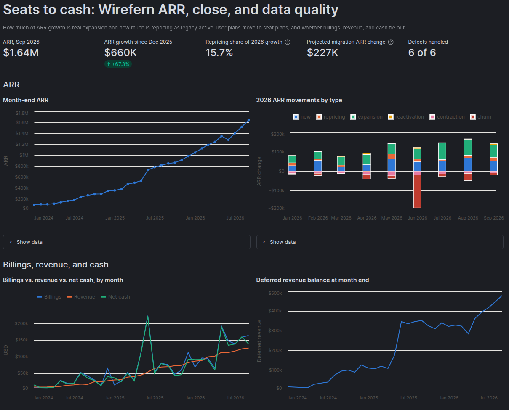
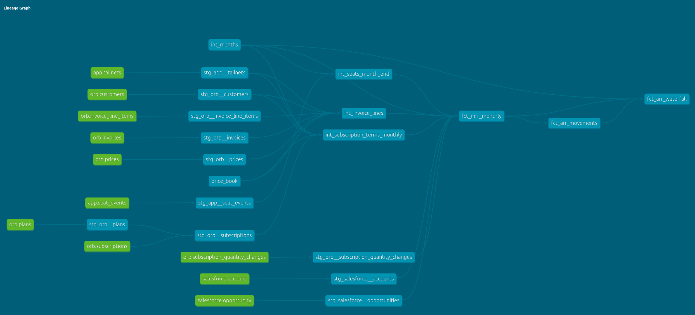
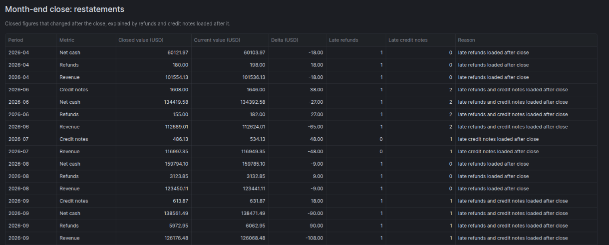
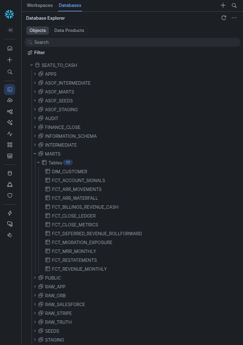
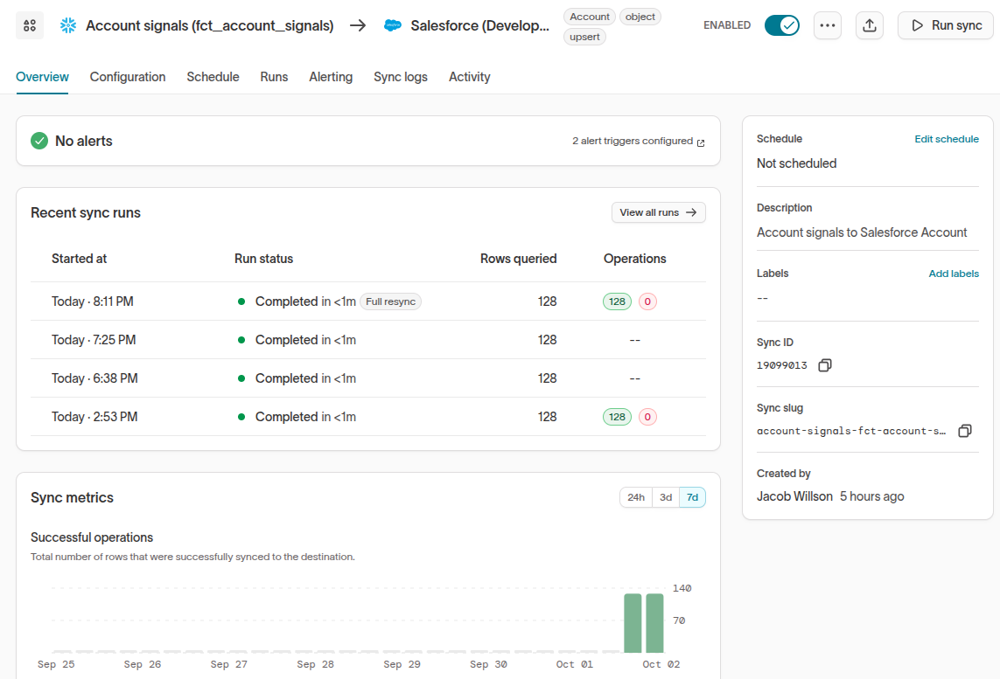
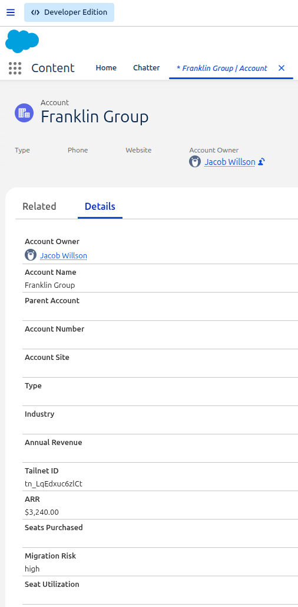
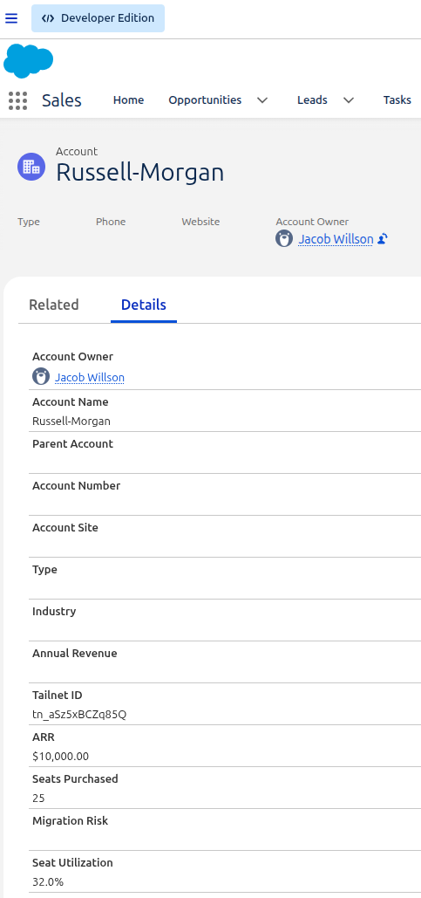

# seats-to-cash

[](https://github.com/JacobWillson13/seats-to-cash/actions/workflows/ci.yml)

**A finance data stack for a product-led SaaS company, built on dbt and Snowflake, where every number is checked against an answer key.**

The company is fictional (Wirefern, a mesh VPN), and **all data is synthetic.** The pricing mechanics are modeled on Tailscale's public pricing page as of October 2026: free personal plans, per-seat business plans with proration and auto seats, annual enterprise contracts, and the April 2026 move from per-active-user to per-seat pricing. Legacy (pre-April 2026) prices are illustrative. I'm not affiliated with Tailscale and used no Tailscale data.

**Walkthrough video (4 min):** VIDEO_URL



## The question

**How much of ARR growth is real expansion, and how much is repricing as legacy active-user plans move to seat plans? And do billings, revenue, and cash tie out along the way?**

## The answers (default run, seed 42)

- **ARR grew 67% in 2026,** from $980,883 in December 2025 to $1,640,775 in September 2026.
- **$103,315 of that growth (15.7%) is repricing, not expansion.** Only $22,392 comes from customers moving to seat pricing so far. The biggest price effect is self-serve customers moving onto enterprise contract pricing (+$111,733), partly offset by lower per-seat rates on enterprise renewals and expansions (−$30,810).
- **The bigger price effect is still ahead.** Moving the 453 remaining legacy tailnets to seats would add about $227k of ARR. 396 of them are high risk: 247 face increases over 40%, and 149 pay nothing today.
- **Billings, revenue, and cash tie out.** The ARR waterfall closes every month, deferred revenue rolls forward to the cent, Orb invoices match deduplicated Stripe invoices, and Stripe cash matches balance transactions.
- **Every number matches the answer key:** 14,924 of 14,924 customer-months of MRR and 15,247 of 15,247 of revenue, to the cent.
- **All six planted data defects are handled,** from duplicate Stripe customers to late refunds.
- **Six month-end closes are immutable.** 16 figures that changed after a close appear as restatements, each traced to the late rows that caused it.

## Run it

Requires [uv](https://docs.astral.sh/uv/) and Python 3.12. No accounts or credentials needed.

```bash
git clone https://github.com/JacobWillson13/seats-to-cash && cd seats-to-cash
make setup
make demo
```

`make demo` takes about two minutes. It generates the seed-42 data, loads DuckDB, runs the dbt build with every test, posts the April to September 2026 closes, and prints each report query.

Other commands:

| Command | What it does |
|---|---|
| `make data` | Generate the data and load `data/seats_to_cash.duckdb` (`CONFIG=config/ci.yml` for a 10% dataset) |
| `make build` | dbt build with all tests, plus the answer-key fence check |
| `make close PERIOD=2026-09` | Post one month-end close; `FORCE=1` replaces a posted one |
| `make close-history` | Post the April to September 2026 closes |
| `make dashboard` | Run the report queries in `analyses/dashboard/` |
| `make test` | Run every pytest suite |
| `make snowflake` | Load the data into Snowflake and run the same dbt build there (see [docs/SETUP.md](docs/SETUP.md)) |

## How it works

```
generator (Python, seeded, offline)  ->  Parquet  ->  DuckDB  or  Snowflake (raw_* schemas)
    raw_app · raw_orb · raw_stripe · raw_salesforce · raw_truth (answer key)
        -> dbt: staging -> intermediate -> marts, plus audit models against the answer key
        -> month-end close: as-of builds -> append-only ledger -> fct_restatements
        -> Streamlit in Snowflake report · LookML · report SQL
        -> fct_account_signals -> Hightouch -> Salesforce Account
```



**Synthetic sources in vendor shapes.** A day-by-day simulation from 2023 through September 2026 writes each system's own version of events, in the table shapes Fivetran and Orb produce: the product database, Orb billing exports, Stripe collections synced from Orb, and Salesforce. Schemas are in [docs/SCHEMAS.md](docs/SCHEMAS.md). The same seed always writes byte-identical files.

**An answer key and planted defects.** The generator records the true MRR, revenue, and identity map before injecting six defects:

- duplicate Stripe customers
- internal test tailnets
- late refunds and credit notes
- duplicate invoice syncs
- soft-deleted rows
- Stripe test-mode rows

Audit models score the marts against the key, and a CI check fails the build if anything else reads it.

**dbt on DuckDB and Snowflake.** The same project runs on both:

- **Staging:** cleans each source and handles the defects.
- **Intermediate:** resolves identity across the product, Orb, Stripe, and Salesforce, and allocates each invoice line to days, matching Orb's own allocation to the cent.
- **Marts:**
  - `fct_mrr_monthly`
  - `fct_arr_movements` and `fct_arr_waterfall`
  - `fct_revenue_monthly`
  - `fct_deferred_revenue_rollforward`
  - `fct_billings_revenue_cash`
  - `fct_migration_exposure`
  - `fct_account_signals`
  - `dim_customer`
- **Tests:**
  - reconciliation tests for the waterfall, deferred revenue, Orb vs. Stripe, and cash
  - unit tests for proration, repricing, a leap-day annual invoice, and contract ARR

**ARR is contracted run-rate, not invoices.** In the month a customer migrates, they get their last legacy invoice and their first seat invoice on the same day, so May 2026 billings jump to $192k against $114k of revenue. ARR doesn't jump. Enterprise ARR equals the contract value exactly.

**Repricing is its own movement.** When a tailnet changes price version, the quantity change at the old price counts as expansion or contraction, and the rest is repricing. Tier upgrades count as expansion. The waterfall still closes exactly.

**Month-end close.** Each close rebuilds the books as of its close date (five business days after month end), runs the reconciliations, and appends 14 metrics to an append-only ledger. Re-closing a period is refused unless forced. Rows that arrive late show up as restatements with their cause; nothing reported is silently overwritten.



## On their stack

- **Snowflake:** the same raw data and dbt project, with key-pair service users, separate transform and read-only roles, and an X-Small warehouse ([scripts/snowflake_setup.sql](scripts/snowflake_setup.sql)).

  

- **Streamlit in Snowflake:** the report in [apps/streamlit_app.py](apps/streamlit_app.py) runs inside Snowflake. Snowsight dashboards were retired in 2026, and Streamlit is Snowflake's replacement. A test renders the app against DuckDB in CI.
- **Hightouch to Salesforce:** `fct_account_signals` is upserted into Salesforce Account on an external Tailnet ID, with ARR, seats, seat utilization, and migration risk. The latest run sent 128 accounts with 0 rejected.

  

  | Legacy account: high migration risk, no seats yet | Enterprise account: 25 seats, 32% used |
  |---|---|
  |  |  |

- **Looker:** LookML views for MRR and ARR movements plus an explore, in [lookml/](lookml/). They're parse-tested in CI but haven't been run on a live Looker instance.
- **Fivetran, Orb, Stripe:** represented by their landing table shapes, generated synthetically.

## Detailed results

| Metric | Value |
|---|---|
| ARR, Dec 2025 → Sep 2026 | $980,882.97 → $1,640,774.80 (+$659,891.83, +67%) |
| 2026 movements | new $424,388.00 · expansion $509,198.13 · repricing $103,315.41 · contraction −$128,256.00 · churn −$282,509.71 · reactivation $33,756.00 |
| Repricing split | +$22,392.00 from 44 tailnets moving v3 → v4 seats · +$111,733.19 from 18 self-serve tailnets moving onto enterprise contracts · −$30,809.78 from lower per-seat rates on 17 enterprise renewals and expansions |
| 2026 billings / revenue / net cash | $1,124,916.21 / $968,768.24 / $1,092,724.93 (fees $14,308.42, refunds $10,718.80, credit notes $7,429.00) |
| Deferred revenue, Sep 30, 2026 | $478,489.70 |
| Answer-key match | MRR 14,924 / 14,924 · revenue 15,247 / 15,247 · identity 28,070 / 28,070 |
| Planted defects handled | D01 14/14 · D03 40/40 · D05 36/36 · D06 68/68 · D09 100/100 · D13 80/80 |
| Migration exposure | 453 legacy tailnets: $437,328 → $664,200 ARR on seats (+$226,872); 396 high, 46 medium, 11 low risk |
| Restatements, Apr to Sep 2026 closes | 16 figures in 5 of 6 periods. Revenue: April −$18, June −$65, July −$48, August −$9, September −$108 |
| Salesforce signals | 152 enterprise accounts; 128 sync-eligible with $1,182,734.80 ARR, 48 still on legacy pricing |
| Build | 129 dbt nodes (models, seeds, data tests, unit tests), all passing |

## Decisions

Every judgment call is recorded in [docs/DECISIONS.md](docs/DECISIONS.md). That includes the policies that belong to Finance rather than analytics engineering, such as refund timing and revenue recognition, which are dbt vars with documented defaults. The full specification is in [docs/SPEC.md](docs/SPEC.md).

## Known limitations and what's not built

- **All data is synthetic,** and the patterns in it were planted on purpose. The point is the pipeline and its controls, not the findings.
- **Orb's role is an assumption:** Orb as the billing engine, Stripe for collection. Its export field names are approximate.
- **The LookML is untested** against a live Looker instance.
- **The Snowflake account is a 30-day trial.** The DuckDB path runs anywhere.
- **Not built:** cut to finish one story completely, and listed here as next steps:
  - marketplace revenue (AWS and Azure)
  - multi-currency and FX movements
  - add-ons
  - the product-led funnel and bring-to-work attribution
  - a live Fivetran connector

## What I'd look at first on a real team

These are questions, not claims about any real company's data:

1. How does ARR reporting separate repricing from expansion as legacy plans migrate over the next year?
2. Are vacant seats, which are billed under seat pricing, tracked as an early contraction signal?
3. How do marketplace and invoice-paid revenue reconcile with Stripe collections at close?

## Author

Jacob Willson · [LinkedIn](https://www.linkedin.com/in/jacob-j-willson) · [GitHub](https://github.com/JacobWillson13)
